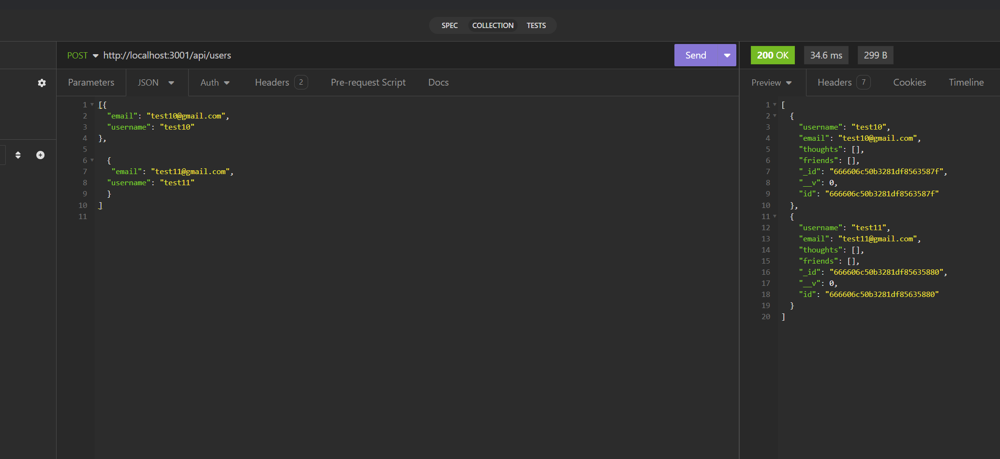

# Social-Network API 

  
  
  ## Description
  
  This is an API for a social network web app where users can share their thoughts, react to friends' thoughts, and create a friend list.
  
  ## Table of Contents 
  
  
  
  - [Installation](#installation)
  - [Usage](#usage)
  - [Credits](#credits)
  - [License](#license)
  - [Questions](#questions)
  - [Tests](#tests)
  
  ## Installation
  
  Open the root folder in you command line and run "node index". Then you will need to open Insomnia, where you can interact with the routes via url http://localhost:3001/api/
  
  ## Usage
  
  Here is a [link](https://drive.google.com/file/d/1smVGoMx0xNZumfRu4ESYXNncyuTXCkN2/view) of a video tutorial as well as a screenshot of the app running in Insomnia.

  
  
  
  
  ## Credits
  
  n/a
  
  ## License
  
  This application is covered under the MIT license.
  
  ## Questions

  For additional questions you can reach me at the following:
  github.com/jpermaul
  n/a

  ## Tests

  n/a
  
  
  
  

